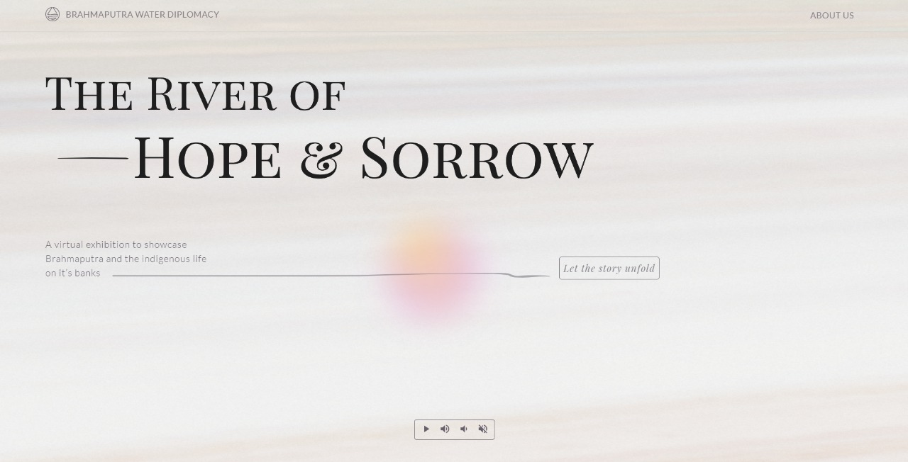
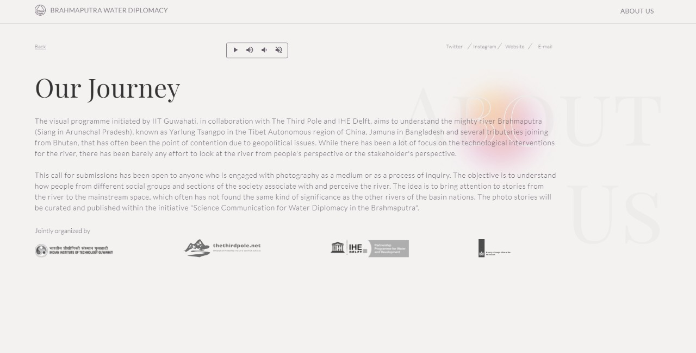
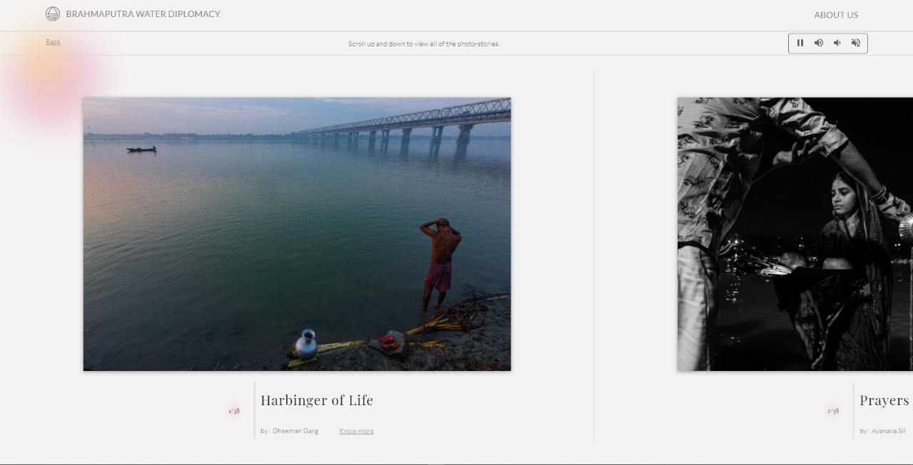
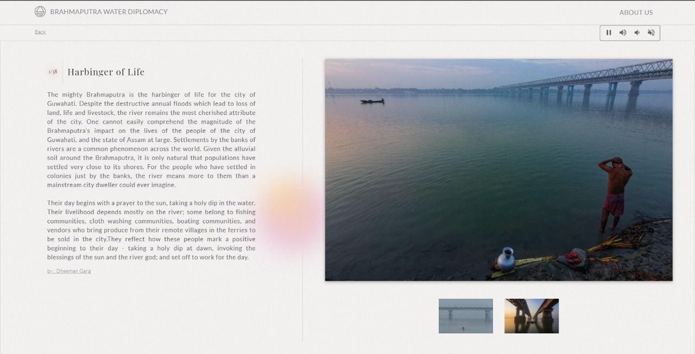
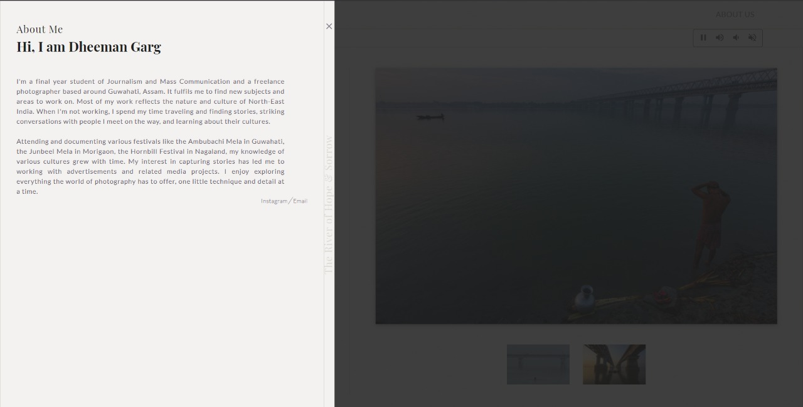

# River Of Hope And Sorrow

A virtual photo exhibition by [Brahmaputra River Water Diplomacy](http://www.brbwaterdiplomacy.com/) to showcase Brahmaputra and the indegenious life around it.

### Table of Content

- [River Of Hope And Sorrow](#river-of-hope-and-sorrow)
    - [Table of Content](#table-of-content)
  - [About](#about)
  - [User Journey](#user-journey)
  - [Technologies Used](#technologies-used)
  - [Prerequisites](#prerequisites)
  - [Installation](#installation)
  - [Structure](#structure)
  - [Contributers](#contributers)

## About 
The project is a virtual exhibition that showcases marvelous images and fascinating stories of Brahmaputra and the lives around the river from participants across the globe. This exhibition was envisioned by Brahmaputra River Water Diplomacy.

The Project is currently hosted at [brahmaputra-exhibition.com](http://brahmaputra-exhibition.com/) and [riverofhopeandsorrow.herokuapp.com](https://riverofhopeandsorrow.herokuapp.com/)

## User Journey
*Home Page*


*About Us Page*


*Exhibition Page*


*Showcase Page*


*About Photographer*


*Comment Section*


## Technologies Used
- [Node.js](https://nodejs.org/en/) - v16.6.0
- [MongoDB](https://www.mongodb.com/) - v5.0.1
  
## Prerequisites
1. npm
   ```sh
   npm install npm@latest -g
   ```
2. nodemon
   ```sh
   npm install nodemon -g
   ```

## Installation
1. Clone the repo
   ```sh
   git clone https://github.com/rathod-aryan/RiverofHopeAndSorrow.git
   ```
2. Change the directory
   ```sh
   cd RiverofHopeAndSorrow
   ```
3. Install Packages
   ```sh
   npm install
   ```
4. Running the server
   ```sh
   npm start
   ```
   Or running server as daemon
   ```sh
   npm run dev
   ```

5. Open the following link in your browser. Ensure you have allowed cookies and required permissions.
    http://localhost:3000/

## Structure]
|                  |                 |
| ---------------- | --------------- |
| /                | Home Page       |
| /about           | About Us page   |
| /projects        | Exhibition Page |
| /projects/<Name> | Showcase Page   |

## Contributers
- [Aryan Rathod](https://www.behance.net/chardeux)
- [Nishtha Rathod](https://github.com/Nishtha131201)
- [Prakhar Rajpali](https://github.com/ThePrakharRajpali)
